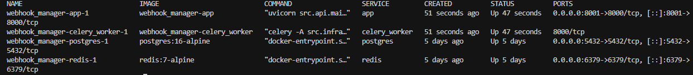
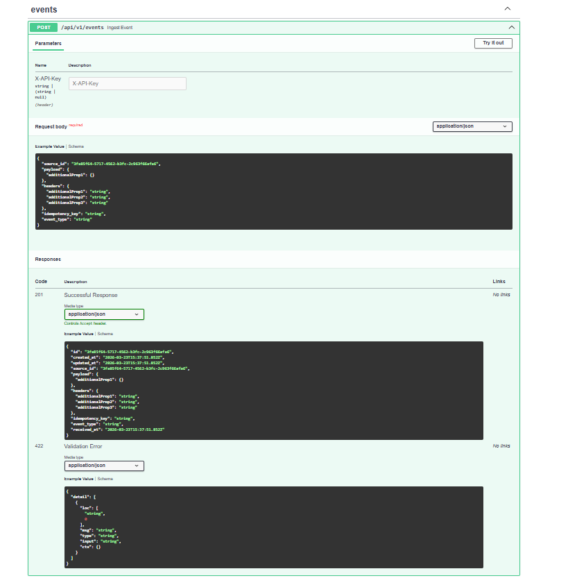
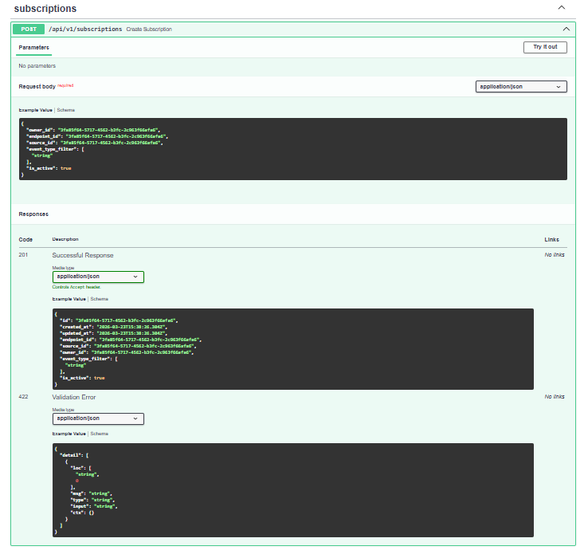
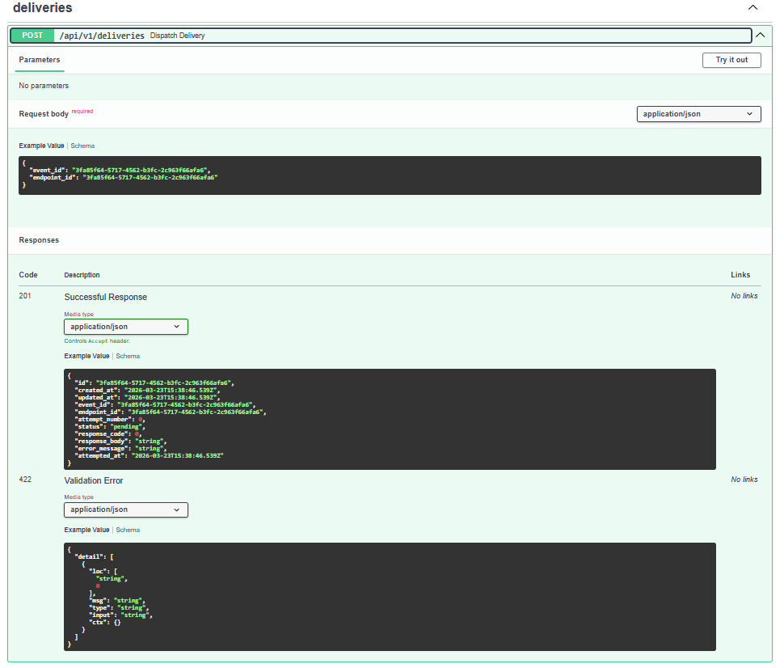
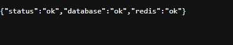
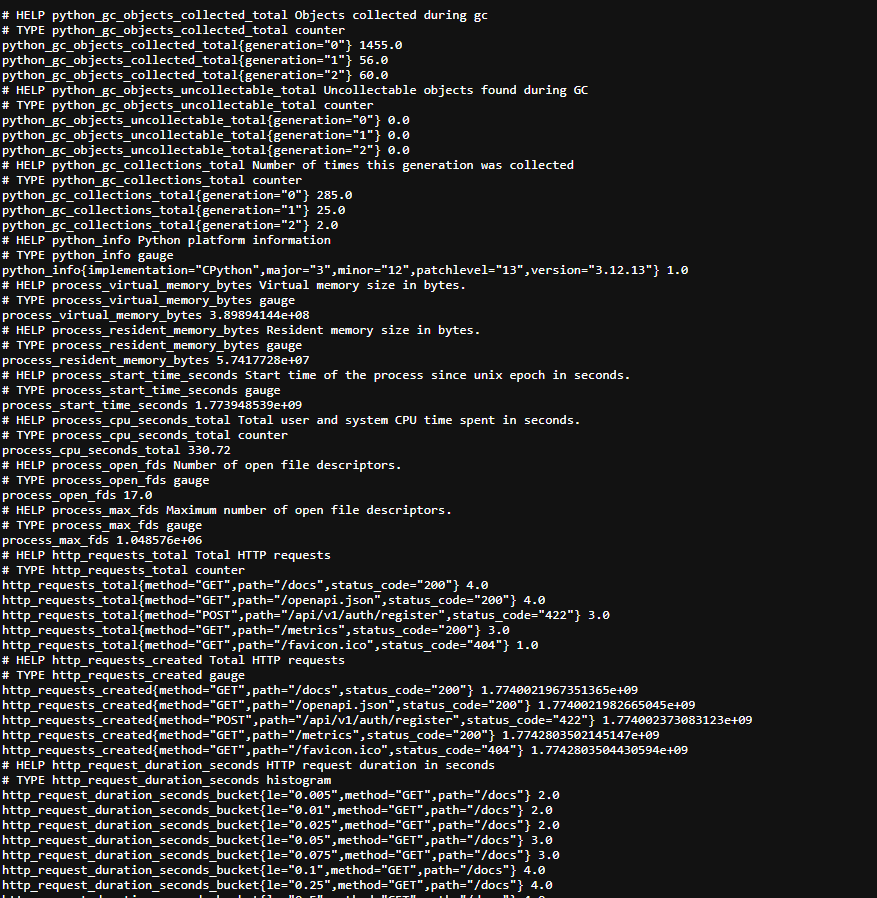

# WebHook Manager

[](https://github.com/sayomiyori/WebHook_Manager/actions/workflows/ci.yml)
[](https://codecov.io/gh/sayomiyori/WebHook_Manager)
[](https://www.python.org/downloads/release/python-3120/)
[](LICENSE)

A production-oriented webhook platform built with **FastAPI**, **PostgreSQL (async)**, **Redis**, and **Celery** — structured with Clean Architecture (Domain / Services / Infrastructure / API).

## What you get

- **Webhook ingest** with idempotency (`X-Idempotency-Key`) and optional HMAC verification (`X-Webhook-Signature`)
- **Subscriptions** with glob matching (e.g. `payment.*`)
- **Delivery engine** with Celery retries + exponential backoff
- **API key auth** via `X-API-Key` (never stores plaintext keys)
- **Observability**
  - Correlation IDs in every request/response (`X-Request-ID`)
  - Structured JSON logs via `structlog`
  - Prometheus metrics on `/metrics`
  - Health checks on `/health`, `/health/live`, `/health/ready`
- **Production-ready CI/CD**
  - GitHub Actions pipeline (lint / tests / security)
  - Docker image builds + VPS auto-deploy

## Screenshots

Examples from a local run (`make up`, app typically on `http://localhost:8001`).

### Docker Compose



### OpenAPI (Swagger UI)







### Health checks



### Prometheus metrics (`GET /metrics`)



## Architecture (high level)

- `src/domain/`: pure entities + repository interfaces
- `src/services/`: business logic only
- `src/infrastructure/`: DB/ORM models, repository implementations, Redis/Celery glue
- `src/api/`: routers, middleware, request/response schemas

## Prerequisites

- Docker + Docker Compose
- Python 3.12+ (for local dev/testing)

## Local development

### Install Python dependencies

```bash
pip install -e ".[dev]"
```

### Run dependencies (Docker)

```bash
make up
```

### Common commands

```bash
make lint
make type-check
make test
make migrate
```

## Observability

### Health

- `GET /health` → `{"status":"ok"}`
- `GET /health/live` → always `200`
- `GET /health/ready` → `200` with `{"status":"ok","database":"ok","redis":"ok"}` if **DB + Redis** are reachable; otherwise `503` with the same keys and `"unavailable"` for failed checks

### Metrics

- `GET /metrics` → Prometheus text format (intended for internal scraping)

### Logs

- JSON logs in production mode
- Every log line includes `correlation_id` (bound from `X-Request-ID`)

## Testing

Run the full suite:

```bash
pytest
pytest --cov=src --cov-report=term-missing
```

The test suite is designed to reach **>= 80% coverage**.

## Production

### CI/CD

- CI workflow runs on `push` to `main/develop` and on PRs targeting `main`
- CD workflow runs on `push` to `main` and deploys only if all CI jobs pass

### Deployment assets

- `docker-compose.prod.yml`: production services (app, celery worker, postgres, redis, nginx with SSL termination)
- `nginx/conf.d/default.conf`: reverse proxy configuration for SSL termination

**Note:** production secrets must be provided via GitHub Secrets and environment variables on the VPS (the compose file references variables; it does not embed secrets in repo files).


