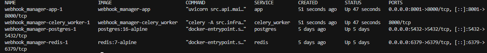
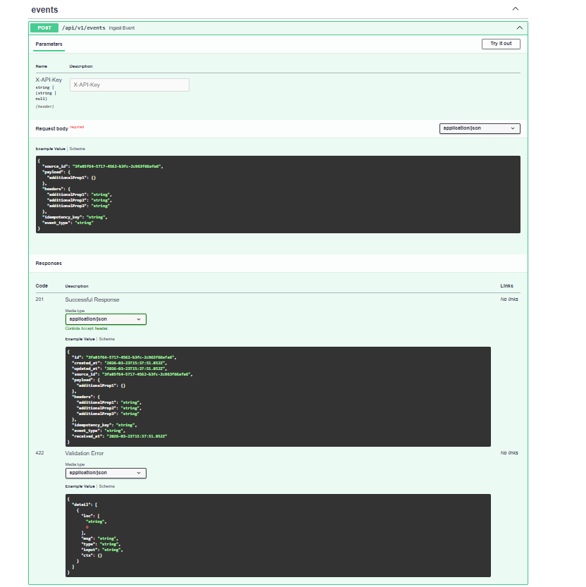
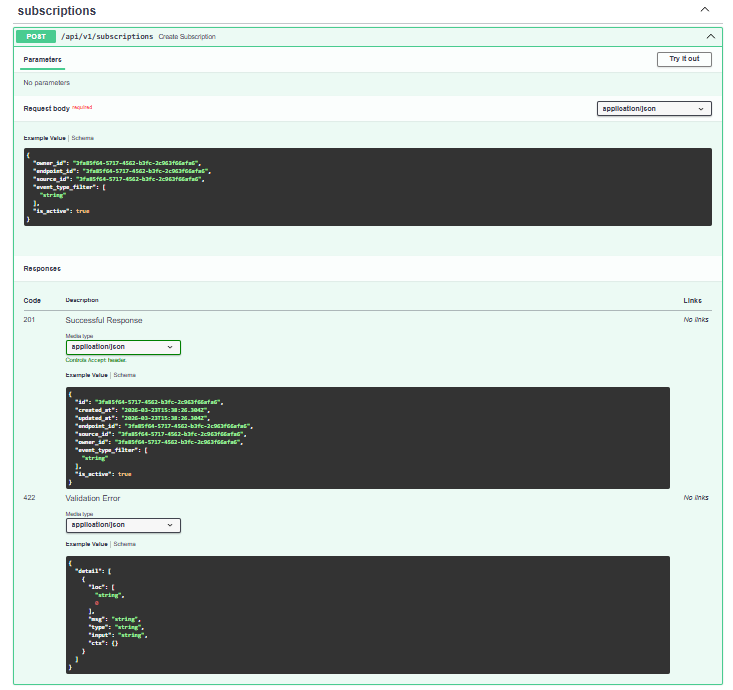
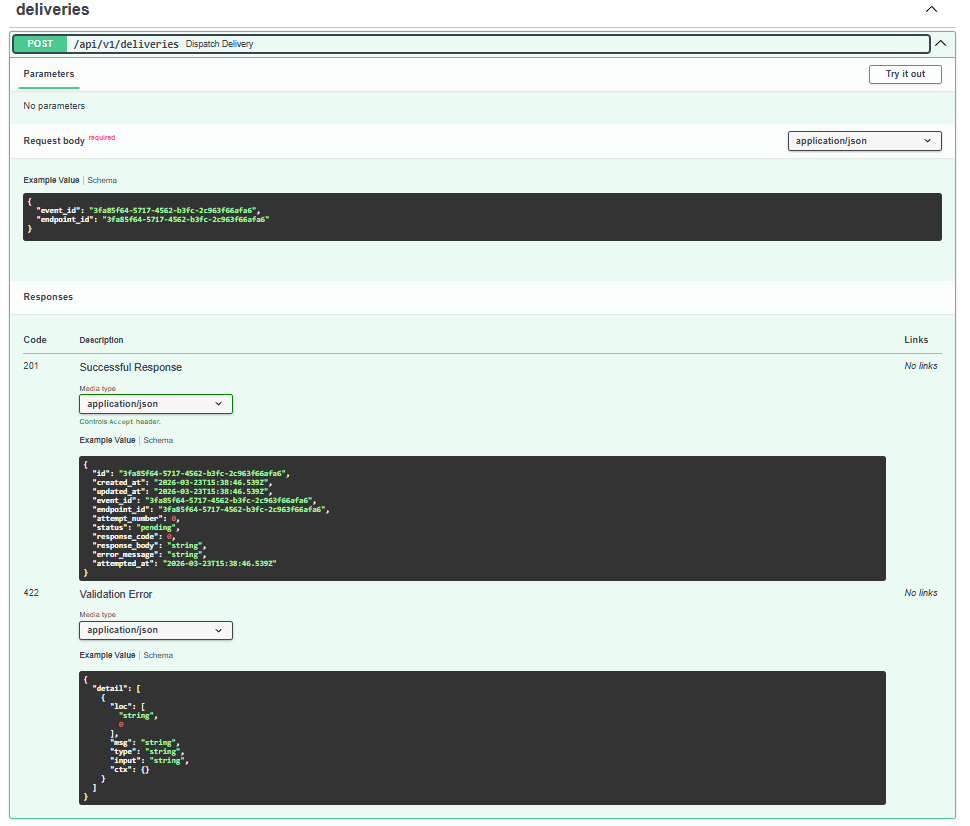
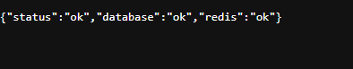
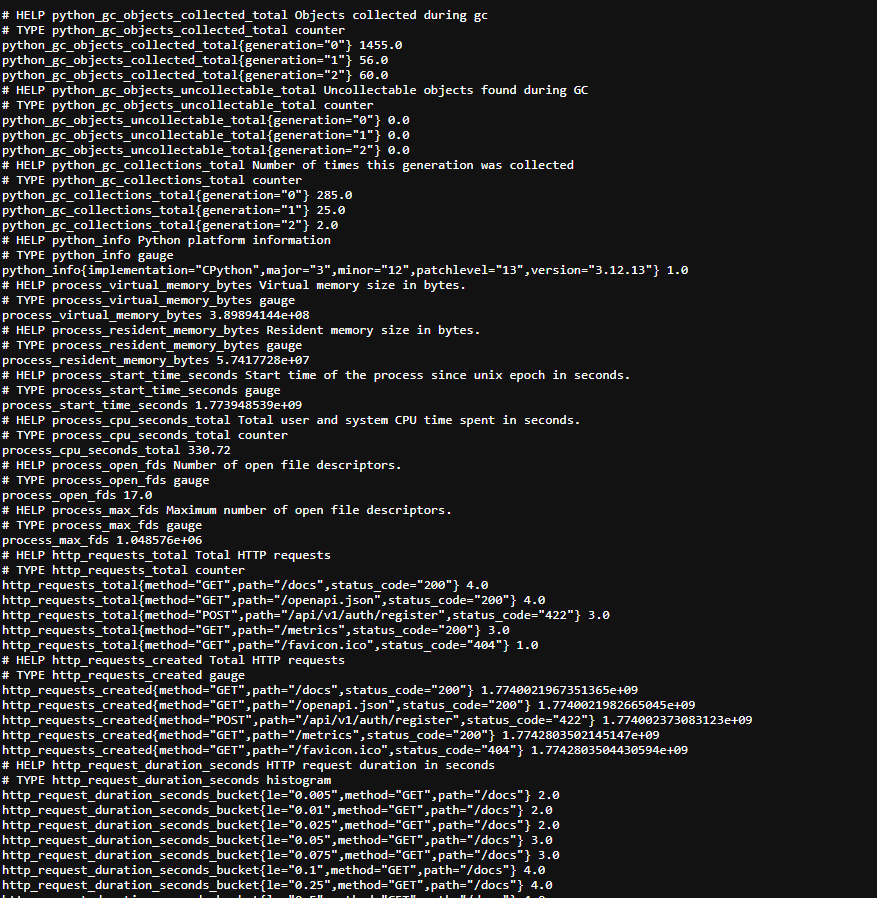

# WebHook Manager

[](https://github.com/sayomiyori/WebHook_Manager/actions/workflows/ci.yml)
[](https://codecov.io/gh/sayomiyori/WebHook_Manager)
[](https://www.python.org/downloads/release/python-3120/)
[](LICENSE)

A production-oriented webhook platform built with **FastAPI**, **PostgreSQL (async)**, **Redis**, and **Celery** — structured with Clean Architecture (Domain / Services / Infrastructure / API).

## What you get

- **Webhook ingest** with idempotency (`X-Idempotency-Key`) and optional HMAC verification (`X-Webhook-Signature`)
- **Subscriptions** with glob matching (e.g. `payment.*`)
- **Delivery engine** with Celery retries + exponential backoff
- **API key auth** via `X-API-Key` (never stores plaintext keys)
- **Observability**
  - Correlation IDs in every request/response (`X-Request-ID`)
  - Structured JSON logs via `structlog`
  - Prometheus metrics on `/metrics`
  - Health checks on `/health`, `/health/live`, `/health/ready`
- **Production-ready CI/CD**
  - GitHub Actions pipeline (lint / tests / security)
  - Docker image builds + VPS auto-deploy

## Screenshots

Examples from a local run (`make up`, app typically on `http://localhost:8001`).

### Docker Compose



### OpenAPI (Swagger UI)







### Health checks



### Prometheus metrics (`GET /metrics`)



## Architecture (high level)

- `src/domain/`: pure entities + repository interfaces
- `src/services/`: business logic only
- `src/infrastructure/`: DB/ORM models, repository implementations, Redis/Celery glue
- `src/api/`: routers, middleware, request/response schemas

## Prerequisites

- Docker + Docker Compose
- Python 3.12+ (for local dev/testing)

## Local development

### Install Python dependencies

```bash
pip install -e ".[dev]"
```

### Run dependencies (Docker)

```bash
make up
```

### Common commands

```bash
make lint
make type-check
make test
make migrate
```

## Observability

### Health

- `GET /health` → `{"status":"ok"}`
- `GET /health/live` → always `200`
- `GET /health/ready` → `200` with `{"status":"ok","database":"ok","redis":"ok"}` if **DB + Redis** are reachable; otherwise `503` with the same keys and `"unavailable"` for failed checks

### Metrics

- `GET /metrics` → Prometheus text format (intended for internal scraping)

### Logs

- JSON logs in production mode
- Every log line includes `correlation_id` (bound from `X-Request-ID`)

## Testing

### Tenant bot registration

AuthFortress authorization/status and Telegram `getMe` clients are implemented
under `src/infrastructure/platform`. Platform routes persist tenant-scoped bots
with encrypted credentials and fresh online authorization through AuthFortress.
Existing standalone API-key authentication remains independent.

After applying `alembic upgrade head`, enabled installations expose:

| Route | Authorization | Behavior |
| --- | --- | --- |
| `POST /api/v1/tenants/{tenant_id}/bots` | Bearer; tenant owner | Verify `{name, token}` with Telegram, reauthorize, encrypt and register |
| `GET /api/v1/tenants/{tenant_id}/bots` | Bearer; tenant member | UUID cursor pagination, limit 1..100 |
| `GET /api/v1/tenants/{tenant_id}/bots/{bot_id}` | Bearer; tenant member | Tenant-scoped read, including inactive bots |
| `POST /api/v1/tenants/{tenant_id}/bots/{bot_id}/deactivate` | Bearer; tenant owner | Idempotent deactivation |
| `GET /internal/v1/bots/{bot_id}/context` | Independent `X-Service-Key` | Active bot and tenant check, no credentials |

Telegram identities remain globally reserved after deactivation. Duplicate
registrations return 409; cross-tenant bot access is hidden with 404. Credentials
are bound to both bot and tenant UUIDs inside Fernet ciphertext. Reads and service
context exclude the token, ciphertext and issuer identity. Inactive context is
403; missing bot is 404; issuer/Redis/provider failures deny access.

Registration starts with `webhook_status: not_configured`. Optional Telegram
provisioning and durable intake are described below. AI consumption and outgoing
answers remain subsequent implementation stages.

`PLATFORM_BOTS_ENABLED` defaults to false. Opt-in validates
`AUTHFORTRESS_BASE_URL`, `BOT_CREDENTIALS_KEY`,
`AUTHFORTRESS_WEBHOOK_SERVICE_KEY` and `WEBHOOK_AGENT_CONTEXT_KEY` at startup.
Use distinct random ASCII service keys of at least 32 bytes and an independently
generated Fernet key; retain the latter separately from database backups.
HTTP issuer URLs are restricted to local loopback or Compose `auth_service`;
other deployments require HTTPS. `RATE_LIMIT_BOT_REGISTER` defaults to 10
admissions per user/tenant in a trailing 60-second window. A single Redis Lua
operation uses server time and unique admission IDs; denied requests do not call
Telegram or extend expiry. Admitted provider failures count against quota.

Clients verify TLS, ignore environment proxies, refuse redirects and perform no
retries. Timeouts are 2 seconds for connect, 5 for read/write/pool and a 10-second
total deadline. Replies are limited to 64 KiB; compressed replies fail closed.
Provider data and errors never become public error messages. Platform HTTP logs
are suppressed because Telegram URLs carry tokens. With platform mode enabled,
Sentry excludes local variables and request bodies/headers/cookies/query data,
drops HTTP breadcrumbs and Telegram events/transactions. This intentionally
reduces diagnostic detail to protect credentials.

## Telegram provisioning and durable intake

`PLATFORM_TELEGRAM_ENABLED=false` keeps the intake routes disabled. Enabling it
requires valid platform registration settings, `TELEGRAM_WEBHOOK_ORIGIN` (a fixed
public HTTPS origin), `AGENTHUB_BASE_URL`, and a distinct
`WEBHOOK_AGENT_INGRESS_KEY`. Service keys must be independent; never reuse the
Fernet key or Telegram token.

An authenticated tenant owner calls
`POST /api/v1/tenants/{tenant_id}/bots/{bot_id}/webhook` with
`{"dry_run":true}` to inspect the URL without writing state or contacting Telegram.
After reviewing it, `{"dry_run":false}` installs the prepared secret using
`setWebhook`, `allowed_updates=["message"]`, `drop_pending_updates=false` and
`max_connections=10`. Confirmed success is `configured`; definite provider failure
is `failed`; ambiguous failure or an expired interrupted attempt is `unknown`.
An active attempt is `configuring`. Retry reuses the stored secret and URL;
concurrent attempts return 409. `getWebhookInfo` cannot prove secret installation.

Telegram posts to `/webhooks/telegram/{bot_id}` with exactly one
`X-Telegram-Bot-Api-Secret-Token`. Authentication precedes bounded JSON streaming
(1 MiB). Private nonempty text is accepted with 202; supported non-text updates
are ignored with 200. Replay of the same canonical update returns 200 and the
original event; changed content for the same bot/update ID returns 409. Ingress
and its publication intent commit together in PostgreSQL, independently of Redis.

Run the existing Celery worker and a separate recovery process:

```bash
python -m scripts.recover_platform_outbox
# A single bounded scan:
python -m scripts.recover_platform_outbox --once
```

Worker/scanner require only database/broker settings, `AUTHFORTRESS_BASE_URL`,
`AUTHFORTRESS_WEBHOOK_SERVICE_KEY`, `AGENTHUB_BASE_URL`, and
`WEBHOOK_AGENT_INGRESS_KEY`. Leave both API feature flags false and omit the
credential encryption key. Recovery scans every five seconds, submits UUIDs in
batches of at most 100, and preserves intent on broker failure. Atomic 60-second
leases fence stale workers; database time governs retry. Publication signs the
immutable envelope and validates a matching receipt. Inactive context cancels;
definite admission rejection fails; transient errors retry with bounded backoff.
`PLATFORM_PUBLICATION_MAX_ATTEMPTS` defaults to 10 (range 1–100). A final expired
claim fails as `admission_outcome_unconfirmed`. Published means a matching job
receipt was persisted; it does not mean AI execution or Telegram reply completed.

NexusCore exposes the optional `telegram-ingress` Compose profile for recovery.
Its AgentHub consumer is still pending: do not enable live publication until that
consumer's contract is implemented and verified.

Controlled acceptance (no live bot/LLM calls) requires dedicated PostgreSQL/Redis,
explicit local `TEST_DATABASE_URL` and `TEST_AUTH_DATABASE_URL` ending `_test`,
the sibling AuthFortress virtualenv, Docker, and a built image:

```bash
docker build -t webhook-verification:local .
python -m scripts.verify_telegram_ingress --image webhook-verification:local
```

The harness creates fresh test databases and uniquely named containers. It stops
only its own containers and retains the databases/containers for inspection.
It exercises real JWT/owner authorization, controlled setup, broker outage,
recovery, durable remote admission with a lost receipt, and replay without a
second remote job.

## Automated tests

```bash
pytest
pytest --cov=src --cov-report=term-missing
```

The test suite is designed to reach **>= 80% coverage**.

## Production

### CI/CD

- CI workflow runs on `push` to `main/develop` and on PRs targeting `main`
- CD workflow runs on `push` to `main` and deploys only if all CI jobs pass

### Deployment assets

- `docker-compose.prod.yml`: production services (app, celery worker, postgres, redis, nginx with SSL termination)
- `nginx/conf.d/default.conf`: reverse proxy configuration for SSL termination

**Note:** production secrets must be provided via GitHub Secrets and environment variables on the VPS (the compose file references variables; it does not embed secrets in repo files).


